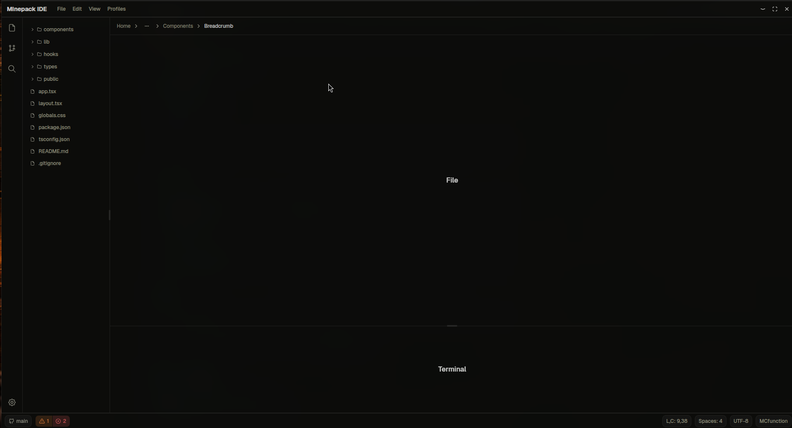

# Minepack IDE


> ⚠️ **Work in Progress** — This project is under active development. Expect breaking changes.

A modern, cross-platform IDE for Minecraft datapack development, built with [Tauri](https://tauri.app/) + React and powered by the [minepack-compiler](https://github.com/ACDPDEV/minepack-compiler) — a native Rust compiler for datapacks.


---

## ✨ Features

- 📁 File explorer with project tree
- 🎨 Light / Dark / System theme
- ⌨️ Code editor with syntax highlighting (Monaco Editor)
- 💻 Integrated terminal
- 🦀 Native datapack compiler via `minepack-compiler`
- 🖥️ Cross-platform — Windows & Linux (macOS untested)

---

## 🚀 Getting Started

### Prerequisites

- [Node.js](https://nodejs.org/) >= 20
- [Rust](https://www.rust-lang.org/tools/install) (latest stable)
- [Tauri CLI](https://tauri.app/v1/guides/getting-started/prerequisites)

```bash
cargo install tauri-cli
```

### Installation

```bash
# Clone the repository
git clone https://github.com/ACDPDEV/minepack-ide.git
cd minepack-ide

# Install dependencies
pnpm install

# Run in development mode
pnpm run tauri dev
```

### Build

```bash
pnpm run tauri build
```

The installer will be available in `src-tauri/target/release/bundle/`.

---

## 🗺️ Roadmap

- [x] Base layout (sidebar, panels, tabs)
- [x] Theme switching (Light / Dark / System)
- [ ] File explorer
- [ ] Monaco Editor integration
- [ ] Integrated terminal (xterm.js)
- [ ] minepack-compiler integration
- [ ] Syntax highlighting for datapack language
- [ ] Command palette (Ctrl+P)
- [ ] Git integration



---

## 🤝 Contributing

Contributions are welcome! This project is in early stages, so there's a lot of room to help.

1. Fork the repository
2. Create a new branch: `git checkout -b feat/your-feature`
3. Make your changes and commit: `git commit -m "feat: add your feature"`
4. Push to your branch: `git push origin feat/your-feature`
5. Open a Pull Request

Please follow [Conventional Commits](https://www.conventionalcommits.org/) for commit messages.

> For major changes, please open an issue first to discuss what you'd like to change.

---

## 📄 License

This project is licensed under the [GPL-3.0 License](./LICENSE).

---

<p align="center">Made with 🦀 by <a href="https://github.com/ACDPDEV">Ahilton Díaz</a></p>
